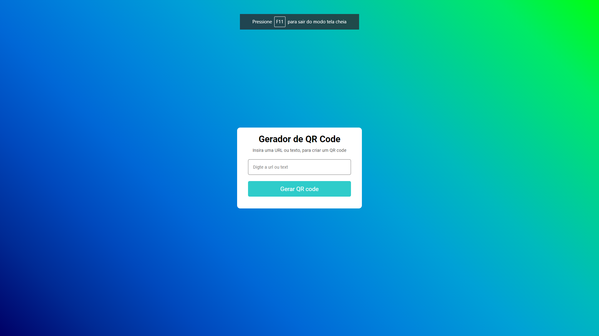

# Gerador de QR Code
Este é um projeto simples que consiste em um gerador de QR Code. O usuário pode inserir uma URL ou texto, e o aplicativo gera um código QR correspondente. Aqui estão algumas informações importantes para entender e utilizar o código.

## Projeto

 

# Conteúdo do Repositório
<ul>
<li>index.html: O arquivo HTML contém a estrutura da página, incluindo a referência aos estilos (CSS) e scripts (JavaScript).</li>
<li>style.css: Este arquivo CSS define a aparência visual da página, aplicando estilos ao container,cabeçalho, formulário e área do QR Code.</li>
<li>index.js: O JavaScript contém a lógica de geração do QR Code e manipulação de eventos.</li>
</ul>

 

# Instruções de Uso
<ol>
<li>Abra o arquivo index.html em um navegador da web.</li>
<li>Insira uma URL ou texto no campo de entrada no formulário.</li>
<li>Clique no botão "Gerar QR code" para visualizar o código QR correspondente.</li>
<li>A área do QR Code será exibida abaixo do formulário.</li>
</ol>

 

# Aprendizados do Código

<ul>
<li>Manipulação de DOM em JavaScript para interações do usuário.</li>
<li>Utilização de folhas de estilo CSS para estilizar elementos HTML.</li>
<li>Integração com uma API externa para geração dinâmica de QR Code.</li>
<li>Uso de transições CSS para criar uma experiência de usuário suave.</li>
</ul>